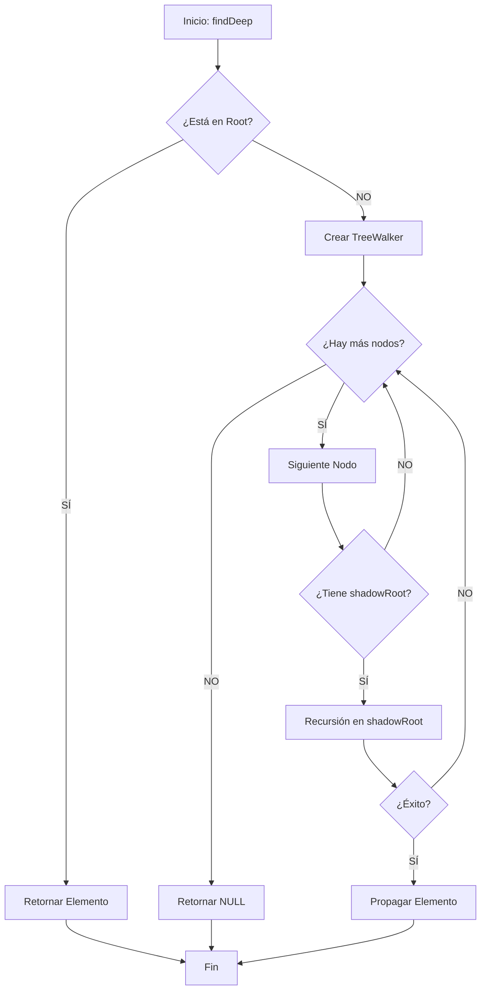

# Algoritmo 01: Búsqueda Recursiva en Shadow DOM (`findDeep`)

## 📌 Definición Actual
Este algoritmo permite localizar elementos en el DOM ignorando las fronteras de encapsulamiento de los **Shadow Roots** abiertos. Es la base técnica que permite a MKdownSEO auditar componentes de frameworks modernos (Lit, Salesforce, etc.).

## 💻 Pseudocódigo (Reflejo del Código Actual)

```text
FUNCIÓN findDeep(selector, nodo_raiz)
    // 1. Intento de búsqueda en el nivel actual
    elemento = nodo_raiz.querySelector(selector)
    SI elemento EXISTE:
        RETORNAR elemento

    // 2. Preparar caminante de árbol para explorar hijos
    caminante = CrearTreeWalker(nodo_raiz, MOSTRAR_ELEMENTOS)

    // 3. Iterar por cada nodo hijo
    MIENTRAS haya siguiente_nodo en caminante:
        // 4. Si el nodo tiene una raíz de sombra (Shadow Root)
        SI siguiente_nodo tiene shadowRoot:
            // 5. Llamada RECURSIVA entrando en la sombra
            resultado = findDeep(selector, siguiente_nodo.shadowRoot)
            
            // 6. Si se encontró en la profundidad, propagar hacia arriba
            SI resultado EXISTE:
                RETORNAR resultado

    // 7. No se encontró en este nivel ni en sus sombras
    RETORNAR nulo
FIN FUNCIÓN
```

## 📊 Diagrama de Flujo (Mermaid)



## 📝 Notas de Implementación (Basado en `content.js`)
- **Eficiencia:** El uso de `TreeWalker` es más eficiente que `querySelectorAll('*')` porque permite detenerse o saltar ramas del árbol dinámicamente.
- **Recursividad:** El algoritmo utiliza recursión de profundidad (DFS). Cada vez que encuentra un `shadowRoot`, detiene la búsqueda actual para entrar en el nuevo contexto.

---
*Firma: jaguardluz 2026*
