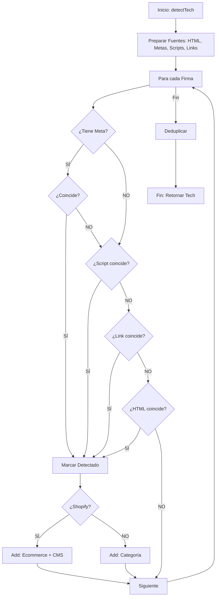

# Algoritmo 02: Detección de Stack Tecnológico (`detectTech`)

## 📌 Definición Actual
Este algoritmo identifica las herramientas, frameworks y plataformas que alimentan un sitio web. Utiliza un enfoque de "cascada de detección" multicanal para asegurar la máxima precisión, analizando desde metadatos específicos hasta patrones en el código fuente global.

## 💻 Pseudocódigo (Reflejo del Código Actual)

```text
FUNCIÓN detectTech()
    // 1. Inicializar contenedor de resultados por categoría
    tech = { CMS: [], Ecommerce: [], Frameworks: [], Analytics: [], Tools: [] }

    // 2. Preparación de fuentes de datos (Normalización a minúsculas)
    html_global = ObtenerOuterHTML().toLowerCase()
    lista_metas = ObtenerTodosLosMetaTags()
    lista_scripts = ObtenerTodosLosSrcDeScripts()
    lista_links = ObtenerTodosLosHrefDeLinks()

    // 3. Definición de Firmas (Signatures)
    firmas = [ ... ] 

    // 4. Iterar sobre cada firma para detección
    PARA CADA firma EN firmas:
        detectado = FALSO

        // Paso A: Verificar Meta Tags
        SI firma tiene meta:
            PARA CADA m EN lista_metas:
                SI (m.name == firma.meta.name O m.property == firma.meta.name)
                   Y (firma.meta.value es vacío O m.content contiene firma.meta.value):
                    detectado = VERDADERO
                    ROMPER ciclo metas

        // Paso B: Verificar Scripts
        SI detectado es FALSO:
            SI algun src EN lista_scripts coincide con firma.pattern:
                detectado = VERDADERO

        // Paso C: Verificar Links
        SI detectado es FALSO:
            SI algun href EN lista_links coincide con firma.pattern:
                detectado = VERDADERO

        // Paso D: Verificar HTML Global
        SI detectado es FALSO:
            SI html_global coincide con firma.pattern:
                detectado = VERDADERO

        // 5. Registrar hallazgo
        SI detectado es VERDADERO:
            Agregar firma.name a tech[firma.cat]
            SI firma.name == "Shopify":
                Agregar "Shopify CMS" a tech.CMS

    // 6. Deduplicación final
    PARA CADA categoria EN tech:
        tech[categoria] = EliminarDuplicados(tech[categoria])

    RETORNAR tech
FIN FUNCIÓN
```

## 📊 Diagrama de Cascada de Detección (Mermaid)



## 📝 Notas de Implementación (Basado en `content.js`)
- **Fidelidad:** El algoritmo prioriza Meta Tags y Scripts sobre el HTML global para reducir falsos positivos.
- **Caso Shopify:** Se maneja una lógica de negocio específica donde Shopify se clasifica en dos categorías simultáneamente.
- **Normalización:** Todos los datos se normalizan a minúsculas antes de la comparación.

---
*Firma: jaguardluz 2026*
