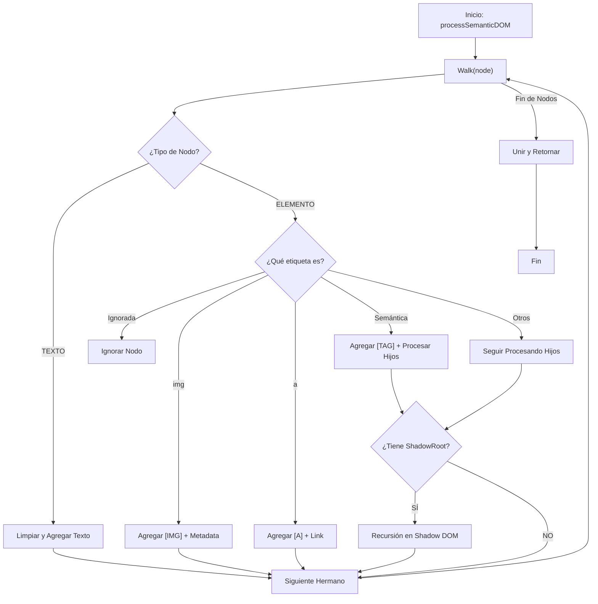

# Algoritmo 03: Procesamiento Semántico y Mapeo DOM (`processSemanticDOM`)

## 📌 Definición Actual
Este algoritmo es el encargado de transformar el árbol DOM bruto en un flujo de información estructurada y "limpia". Su función principal es discriminar el ruido técnico y mapear el contenido visual a una jerarquía de tokens semánticos que el auditor SEO/UX puede interpretar fácilmente.

## 💻 Pseudocódigo (Reflejo del Código Actual)

```text
FUNCIÓN processSemanticDOM(elemento_raiz)
    // 1. Inicializar buffer de salida
    salida = []

    // 2. Función recursiva de caminata (Walking)
    FUNCIÓN walk(nodo, etiqueta_padre)
        SI nodo es ELEMENTO:
            etiqueta = ObtenerTagName(nodo).toLowerCase()
            etiquetas_semanticas = ['p', 'li', 'h1', 'h2', 'h3', 'h4', 'h5', 'h6', 'article', 'section']

            // Discriminación de ruido (Etiquetas ignoradas)
            SI etiqueta EN ['script', 'style', 'input', 'button', 'svg', 'noscript', 'iframe']:
                RETORNAR

            // Caso A: Imagen
            SI etiqueta == 'img':
                salida.PUSH("[IMG] SRC: " + nodo.src + " | ALT: " + nodo.alt)
            
            // Caso B: Enlace
            SINO SI etiqueta == 'a':
                salida.PUSH("[A] TEXT: " + nodo.innerText + " | URL: " + nodo.href)

            // Caso C: Etiquetas Semánticas
            SINO SI etiqueta EN etiquetas_semanticas:
                salida.PUSH("[" + etiqueta.toUpperCase() + "]")
                PARA CADA hijo EN nodo.childNodes: walk(hijo, etiqueta)
                
                // Penetración en Shadow DOM
                SI nodo.shadowRoot:
                    PARA CADA hijo_shadow EN nodo.shadowRoot.childNodes: walk(hijo_shadow, etiqueta)
                
            // Caso D: Contenedores (div, span, etc.)
            SINO:
                PARA CADA hijo EN nodo.childNodes: walk(hijo, etiqueta_padre)
                SI nodo.shadowRoot:
                    PARA CADA hijo_shadow EN nodo.shadowRoot.childNodes: walk(hijo_shadow, etiqueta_padre)

        SI nodo es TEXTO:
            texto_limpio = LimpiarEspacios(nodo.textContent)
            SI texto_limpio EXISTE:
                salida.PUSH(texto_limpio)

    // 3. Ejecutar caminata desde la raíz
    walk(elemento_raiz)
    
    RETORNAR salida.JOIN('')
FIN FUNCIÓN
```

## 📊 Diagrama de Procesamiento Semántico (Mermaid)



## 📝 Notas de Implementación (Basado en `content.js`)
- **Arquitectura:** El algoritmo utiliza una función anidada `walk` que permite mantener el contexto de la `etiqueta_padre` durante la recursión.
- **Transparencia en Shadow DOM:** A diferencia de la mayoría de los extractores, este procesa tanto los hijos estándar como los del Shadow Root en el mismo flujo semántico.
- **Normalización de Texto:** Colapsa espacios y saltos de línea para evitar fragmentación innecesaria en el reporte.

---
*Firma: jaguardluz 2026*
