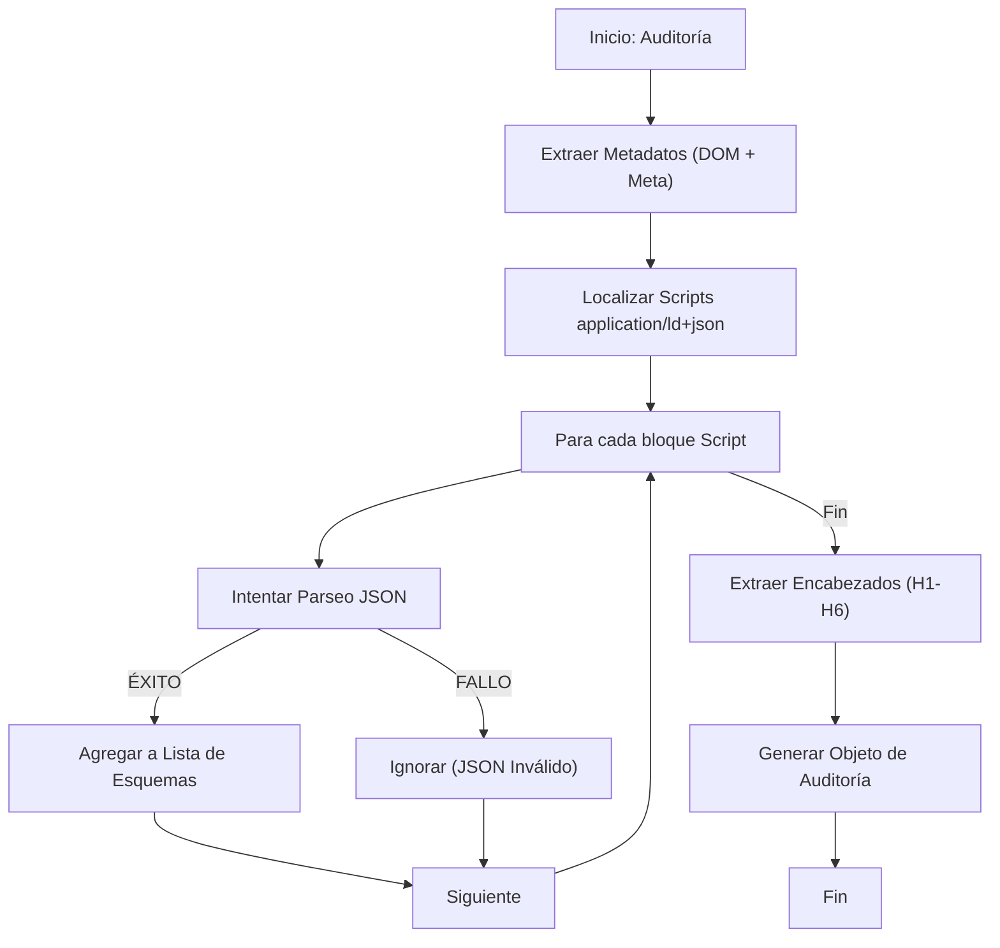

# Algoritmo 04: Extracción de Metadatos y Schema.org (`extractMetadata` & `extractSchema`)

## 📌 Definición Actual
Este conjunto de funciones se encarga de recolectar la capa "invisible" del sitio web: los metadatos de SEO y los datos estructurados. Está diseñado para ser resiliente ante errores de sintaxis en el sitio auditado y para capturar cambios dinámicos en tiempo real.

## 💻 Pseudocódigo (Reflejo del Código Actual)

### 4.1. Extracción de Metadatos
```text
FUNCIÓN extractMetadata()
    RETORNAR {
        title: document.title,
        lang: ObtenerIdiomaHTML(),
        description: getMeta('description'),
        robots: getMeta('robots'),
        canonical: querySelector('link[rel="canonical"]').href,
        ogTitle: getMeta('og:title', 'property'),
        ogDesc: getMeta('og:description', 'property'),
        twitterCard: getMeta('twitter:card'),
        twitterTitle: getMeta('twitter:title'),
        twitterDesc: getMeta('twitter:description')
    }
FIN FUNCIÓN
```

### 4.2. Extracción Segura de Schema (JSON-LD)
```text
FUNCIÓN extractSchema()
    scripts = document.querySelectorAll('script[type="application/ld+json"]')
    
    objetos_validos = []
    
    PARA CADA s EN scripts:
        INTENTAR:
            json = ParsearJSON(s.innerText)
            SI json EXISTE:
                objetos_validos.PUSH(json)
        CAPTURAR ERROR:
            IGNORAR (Resiliencia ante JSON malformado)

    RETORNAR objetos_validos
FIN FUNCIÓN
```

## 📊 Diagrama de Auditoría de Metadatos (Mermaid)



## 📝 Notas de Implementación (Basado en `content.js`)
- **Resiliencia:** `extractSchema` es fundamental porque muchos sitios tienen errores en su JSON-LD. El uso de `try-catch` asegura que la extensión no se bloquee.
- **Lectura Directa del DOM:** Al usar `document.title` y `document.documentElement.lang`, se capturan valores incluso si han sido modificados por JavaScript después de la carga inicial.
- **Normalización:** Se asegura de filtrar resultados nulos o vacíos antes de entregar el paquete de datos al generador.

---
*Firma: jaguardluz 2026*
