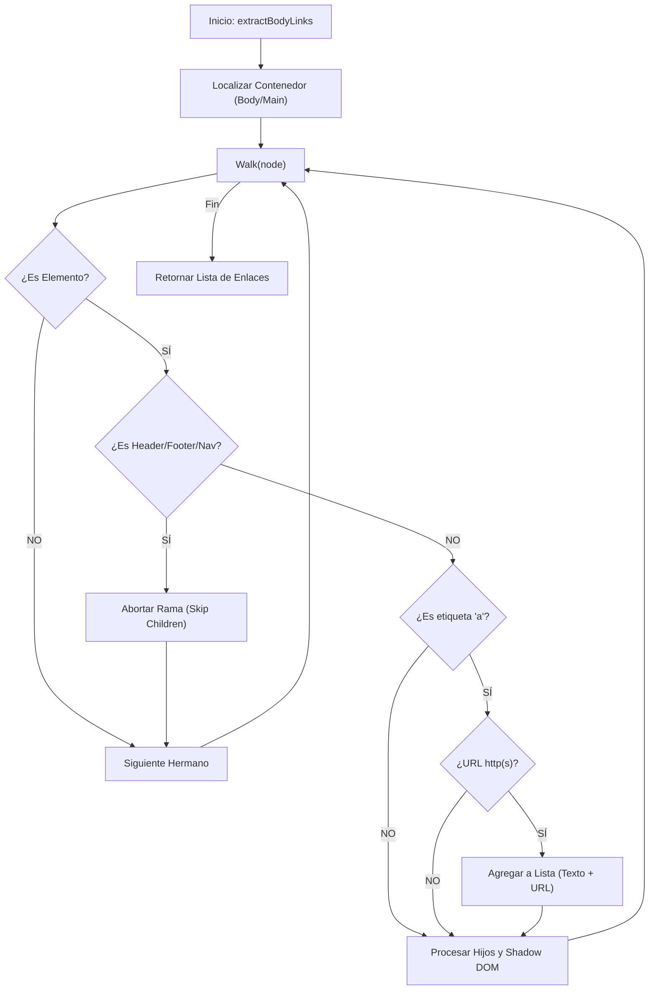

# Algoritmo 05: Catálogo de Enlaces del Body (`extractBodyLinks`)

## 📌 Definición Actual
Este algoritmo se especializa en la recolección de enlaces (`<a>`) que residen exclusivamente en el cuerpo principal de la página. Su valor diferencial radica en la **discriminación de ruido de navegación**, ignorando automáticamente enlaces que pertenecen al encabezado (header), pie de página (footer) o menús de navegación globales.

## 💻 Pseudocódigo (Reflejo del Código Actual)

```text
FUNCIÓN extractBodyLinks(selector_body)
    // 1. Localizar el contenedor principal (con soporte Shadow DOM)
    contenedor = findDeep(selector_body)
    SI contenedor NO EXISTE: RETORNAR []

    enlaces_filtrados = []

    // 2. Función recursiva de filtrado y recolección
    FUNCIÓN walkLinks(nodo)
        SI nodo es ELEMENTO:
            etiqueta = ObtenerTagName(nodo).toLowerCase()
            
            // Discriminación: Identificar si el nodo o sus ancestros son ruido
            es_ruido = etiqueta EN ['header', 'footer', 'nav'] O
                       nodo.closest('header, [role="banner"], footer, [role="contentinfo"], nav')
            
            // 3. Abortar descenso si es una sección excluida
            SI es_ruido: RETORNAR

            // 4. Capturar enlace si es un anchor text válido
            SI etiqueta == 'a':
                texto = LimpiarEspacios(nodo.innerText) O "Sin texto"
                SI nodo.href comienza con "http":
                    enlaces_filtrados.PUSH({ texto: texto, url: nodo.href })

            // 5. Continuar travesía en hijos y Shadow DOM
            SI nodo.shadowRoot:
                PARA CADA hijo EN nodo.shadowRoot.childNodes: walkLinks(hijo)
            
            PARA CADA hijo EN nodo.childNodes: walkLinks(hijo)

    // 6. Iniciar recolección
    walkLinks(contenedor)

    RETORNAR enlaces_filtrados
FIN FUNCIÓN
```

## 📊 Diagrama de Extracción de Enlaces (Mermaid)



## 📝 Notas de Implementación (Basado en `content.js`)
- **Punto de Corte:** Al utilizar `return` inmediatamente después de detectar `es_ruido`, el algoritmo ahorra recursos al no procesar miles de enlaces que suelen existir en megamenús o pies de página complejos.
- **Precisión SEO:** Este catálogo es vital para el análisis de enlazado interno (Internal Linking) ya que solo considera los enlaces contextuales dentro del contenido editorial.
- **Normalización:** Se asigna el valor "Sin texto" a enlaces que solo contienen imágenes o están vacíos, alertando al auditor sobre posibles fallos de accesibilidad.

---
*Firma: jaguardluz 2026*
